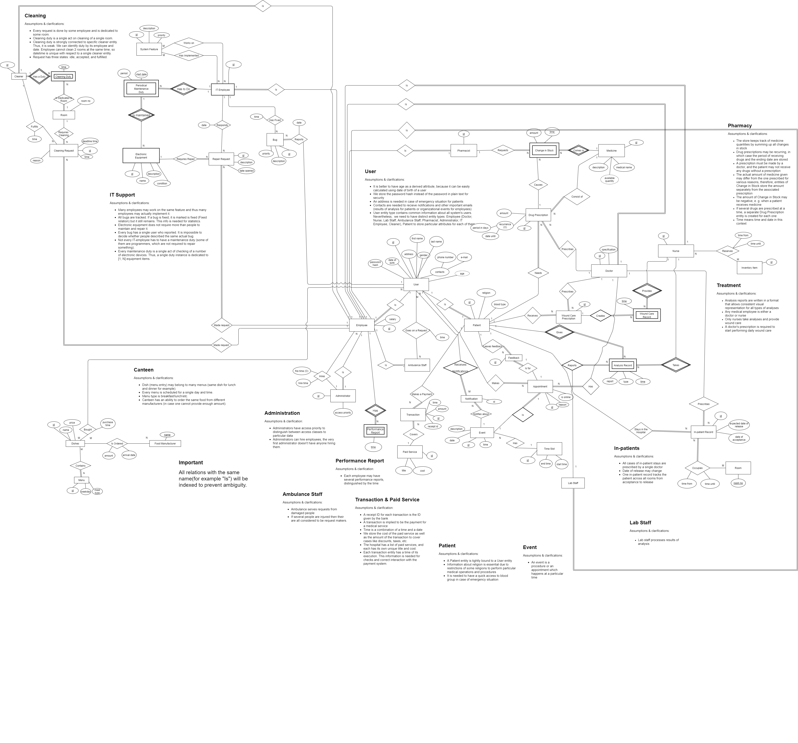

# DMD Project

Here is the ER diagram of the developed database for a hospital.


Further, one can find information about the actual implementaion: database schemas, population scripts, examples of queries.

## Prerequisites

A running PostgreSQL server:
```bash
$ sudo systemctl start postgresql
```


## 1. A SQL dump file for creation and population of the database.

Filename: `db_creation_postgres.sql`  
This file, when executed, will create a database, `hospital`, and create
the necessary tables.  
**Important**: this file does not contain INSERT statements, despite
the assignment description. Instead, the INSERT statements can be found
in the file `db_population_*.sql`, which is described later in the document.
This was done to ease the regeneration of data, since the creation is manual
and the population is semi-automatic.

```bash
$ psql -f db_creation_postgres.sql
```

Filename: `db_population_postgres.sql`  
This file is the direct output of a Python script `data_generator.py`,
which requires the `faker` Python library to be executed.

```bash
# to be run after db_creation_postgres.sql
$ psql -d hospital -f db_population_postgres.sql
```


## 2. SQL queries for the specified statements

Filenames: `queries/query[1-5](-1)?.sql`

Those are the queries as per the assignment requirements.  
**Important**: the first query is parametrized by user input
and thus cannot be run directly. The parameter was replaced by
a placeholder for `psycopg2`, the Python binding for PostgreSQL.  
To see the queries in action, see the 4th deliverable.


## 3. Database implemented in two different RDBMS

Filenames: `db_creation_postgres.sql`, `db_creation_sqlite.sql`  
Filenames: `db_population_postgres.sql`, `db_population_sqlite.sql`  
Alongside PostgreSQL, you may find the SQLite implementation of the database.


## 4. Python implementation

All the scripts are implemented in Python 3.7.4

Filename: `data_generator.py`  
Requirements: `faker` (to be installed from pip)  
The script that generates sample INSERT statements to the database and prints
them to the standard output.

```bash
$ pip install faker
$ python data_generator.py > inserts.sql
```

Filename: `query_runner.py`  
Requirements: `pick`, `tabulate`, `pypager`, `psycopg2` (to be installed from pip)  
The console user interface to run the desired queries.  
This script connects to the `hospital` PostgreSQL database running locally
on the default port. If there is a need to specify a different PostgreSQL
server, use the `DATABASE_URL` environment variable.

```bash
$ pip install pick tabulate pypager psycopg2
$ python query_runner.py
```


## Extras

Filename: `data_generator_sqlite.py`  
To simplify the translation of INSERT statements to SQLite,
a separate version of the data generator script is available.
